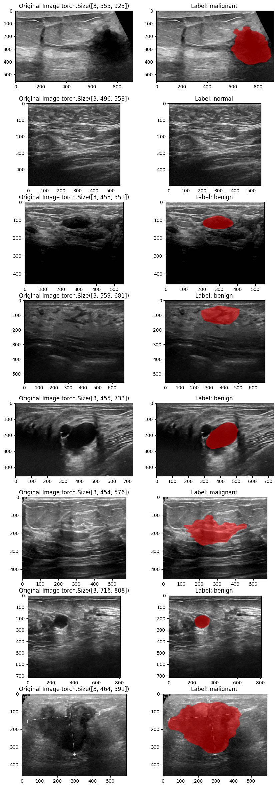
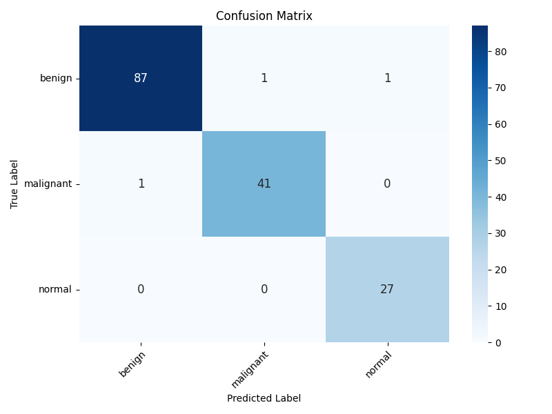
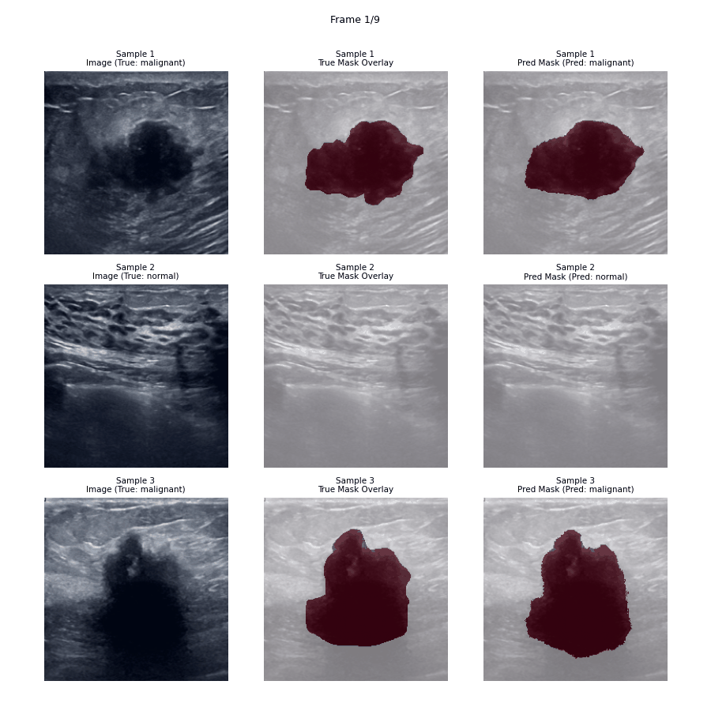
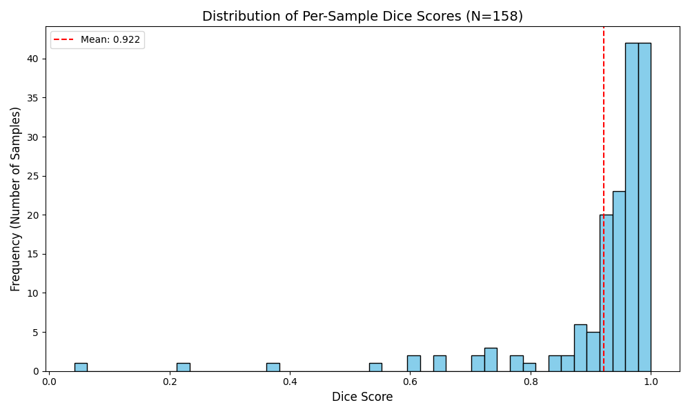

## 🩺 PyTorch Breast Ultrasound Segmentation & Classification

This project implements deep learning models using PyTorch for segmenting lesions and classifying tissue types (e.g., benign, malignant, normal) in breast ultrasound images. It utilizes a VGGNet encoder combined with an FCN decoder for segmentation and includes a separate head for classification. Configuration is managed using Hydra.

## About Dataset

Breast cancer is one of the most common causes of death among women worldwide. Early detection helps in reducing the number of early deaths. The data reviews the medical images of breast cancer using ultrasound scan. Breast Ultrasound Dataset is categorized into three classes: normal, benign, and malignant images. Breast ultrasound images can produce great results in classification, detection, and segmentation of breast cancer when combined with machine learning.

### Data

The data collected at baseline include breast ultrasound images among women in ages between 25 and 75 years old. This data was collected in 2018. The number of patients is 600 female patients. The dataset consists of 780 images with an average image size of 500\*500 pixels. The images are in PNG format. The ground truth images are presented with original images. The images are categorized into three classes, which are normal, benign, and malignant.

If you use this dataset, please cite:
Al-Dhabyani W, Gomaa M, Khaled H, Fahmy A. Dataset of breast ultrasound images. Data in Brief. 2020 Feb;28:104863. DOI: 10.1016/j.dib.2019.104863.



## ✨ Key Features

- **Combined Segmentation and Classification:** Models are designed to perform both tasks simultaneously.
- **VGG-FCN Architecture:** Implements VGGNet (with all the different variations e.g vggnet11, vggnet13, vggnet16, vggnet19) as an encoder backbone with FCN8/FCN16 decoders for semantic segmentation.
- **Modular Design:** Base model class (`SegmentationBaseModel`) handles training loops, loss calculation, and metric aggregation, allowing for easy extension with new architectures.
- **Configuration Management:** Uses Hydra for flexible configuration via YAML files and command-line overrides.
- **Metric Tracking:** Calculates and logs key metrics for both tasks:
  - Segmentation: Dice Coefficient, Segmentation Loss
  - Classification: Accuracy, AUROC, Classification Loss
  - Combined: Total Weighted Loss
- **Pre-trained Weights:** Leverages pre-trained weights for the VGGNet encoder backbone.
- **Custom Dice loss and metric for Imbalance dataset:** `src/losses/dice_loss.py`

## 🛠️ Technologies Used

- **Python:** Core programming language.
- **Pytorch:** Deep learning framework.
- **VGGNet:** Pre-trained convolutional neural network ( with all the different variations e.g vggnet11, vggnet13 and so on) - Image classification.
- **FCN:** Image segmentation architecture (FCN8, FCN16).
- **Jupyter Notebook:** For exploratory data analysis (EDA), model development, and training.
- **MLflow:** Experiment tracking and model management.
- **Hydra:** Configuration management.
- **Kaggle:** Dataset management and download.
- **Docker:** Containerization for consistent environment.
- **VS Code Dev Containers:** Development environment setup.
- **Github Workflow:** for testing.

## Project Structure

```
├── configs
│   ├── data
│   │   ├── breast_cancer_dataset.yaml
│   │   └── default.yaml
│   ├── datamodule
│   │   ├── breast_cancer_datamodule.yaml
│   │   └── default.yaml
│   ├── experiments
│   ├── extras
│   │   └── default.yaml
│   ├── hydra
│   │   └── default.yaml
│   ├── losses
│   │   ├── cross_entropy.yaml
│   │   ├── default.yaml
│   │   └── dice_loss.yaml
│   ├── models
│   │   ├── default.yaml
│   │   ├── nets
│   │   │   ├── fcn.yaml
│   │   │   ├── vanella_vggnet.yaml
│   │   │   └── vgg_net_encoder.yaml
│   │   ├── optimizer
│   │   │   ├── adamw.yaml
│   │   │   └── adam.yaml
│   │   ├── scheduler
│   │   │   ├── cosine_anneal.yaml
│   │   │   └── none.yaml
│   │   └── vggnet_fcn_segmentation_model.yaml
│   ├── paths
│   │   └── default.yaml
│   ├── trainer
│   │   └── default.yaml
│   └── train.yaml
├── Dockerfile
├── LICENSE
├── node_modules
├── notebooks
│   ├── 01_exploratory_data_analysis.ipynb
│   ├── 02_model_vggnet_fcn_define.ipynb
│   ├── 02_model_vggnet_fcn_training_single_head_setup.ipynb
│   └── 03_model_vggnet_fcn_training_both_heads_segmentation_classification_setup.ipynb
├── pyproject.toml
├── README.md
├── requirements.txt
├── results
│   ├── model_summary.txt
│   ├── predictions_animation.gif
│   └── unprocess-images.png
├── ruff.toml
├── src
│   ├── datamodules
│   │   ├── breast_cancer_dataloader_module.py
│   │   ├── components
│   │   │   ├── breast_cancer_dataset.py
│   │   │   ├── __init__.py
│   │   ├── __init__.py
│   ├── evaluate.py
│   ├── __init__.py
│   ├── losses
│   │   ├── dice_loss.py
│   │   ├── __init__.py
│   ├── models
│   │   ├── basemodel.py
│   │   ├── components
│   │   │   ├── classification_head.py
│   │   │   ├── __init__.py
│   │   │   ├── nets
│   │   │   │   ├── fcns.py
│   │   │   │   ├── __init__.py
│   │   │   │   ├── vanilla_vggnet_feature_extractor.py
│   │   │   │   ├── vanilla_vggnet.py
│   │   │   │   ├── vgg_net_encoder.py
│   │   │   │   └── vggnet_utils.py
│   │   ├── __init__.py
│   │   └── vggnet_fcn_segmentation_model.py
│   ├── train.py
│   └── utils
│       ├── gpu_utils.py
│       ├── train_utils.py
│       └── visualizations.py
├── tests
│   ├── datamodules
│   │   ├── components
│   │   │   ├── __init__.py
│   │   │   └── test_breast_cancer_dataset.py
│   │   ├── __init__.py
│   │   └── test_breast_cancer_dataloader_module.py
│   ├── __init__.py
│   ├── models
│   │   ├── __init__.py
│   │   ├── nets
│   │   │   ├── __init__.py
│   │   │   ├── test_fcns.py
│   │   │   ├── test_vanilla_vggnet.py
│   │   │   └── test_vggnet_encoder.py
│   │   └── test_vggnet_fcn_segmentation_model.py
│   └── test_configs.py
└── uv.lock
```

## 🔧 Setup & Installation

1. **Clone the repository:**

   ```bash
   git clone https://github.com/vivekpatel99/breast-cancer-segmentation-vgg-fcn-pytorch.git
   cd PyTorch-Breast-Ultrasound-Segmentation
   ```

2. **Install VS Code Extensions:**

   - Docker
   - Dev Containers

3. **Rebuild and Reopen in Container:**

   - Press `Ctrl+Shift+P` (or `Cmd+Shift+P` on macOS).
   - Select `Dev Containers: Rebuild and Reopen in Container`.

4. **Set up Environment Variables:**

   - Create a `.env` file in the project root directory.
   - Define the path to your dataset:
     ```dotenv
     # .env
     KAGGLE_USERNAME=
     KAGGLE_KEY=
     ```
   - The `train.py` script uses `pyrootutils` and `dotenv` to automatically load this.

## Dataset

- The project expects a dataset containing breast ultrasound images, corresponding segmentation masks, and classification labels.
- The dataloader (defined in `src/data`) should be configured to load images (e.g., `[B, C, H, W]`), masks (e.g., `[B, 1, H, W]`), and labels (e.g., `[B]`).
- Ensure the path specified in `DATA_ROOT` within your `.env` file points to the correct location.
- Modify the data loading and preprocessing steps in `src/data` and the corresponding Hydra configuration (`configs/data/*.yaml`) if your dataset structure differs.

## ⚙️ Configuration

- This project uses Hydra for managing configurations.
- The main configuration file is `configs/train.yaml`.
- It composes configurations from subdirectories like `configs/model`, `configs/data`, etc.
- You can modify parameters directly in the YAML files or override them via the command line.

**Example:** Change the model type or learning rate:

```bash
python src/train.py model=vggnet_fcn_fcn16 trainer.learning_rate=0.0005
```

## 🏋️ Training

1. Configure: Adjust parameters in the configs/\*\*/\*.yaml files as needed (e.g., batch size, epochs, learning rate, model type, loss weights).
2. Run Training: Execute the main training script:

```bash
python src/train.py
```

3.Overrides: Use command-line overrides for quick experiments:

```bash
# Train with FCN16 decoder instead of the default
python src/train.py model=vggnet_fcn_fcn16

# Train for more epochs
python src/train.py trainer.max_epochs=50

# Change segmentation/classification loss weighting
python src/train.py model.seg_weight=0.9 model.cls_weight=0.1
```

4. Output: Training logs and checkpoints will typically be saved in an outputs/ directory managed by Hydra (check hydra.run.dir in the config). Validation metrics are printed at the end of each epoch.

## Models

**VGGNetFCNSegmentationModel:**

- Uses a VGGNet encoder (vgg11, vgg13, vgg16, vgg19, with or without batch normalization). Configurable via model.vggnet_type.
- Uses an FCN decoder (fcn8 or fcn16). Configurable via model.fcn_type.
- Includes a separate classification head operating on the encoder's features.
- Outputs both segmentation logits (masks) and classification logits (labels).

## Evaluation

- **Validation metrics** (Losses, Dice, Accuracy, AUROC) are calculated and logged during training after each epoch.
  **(Future Work Suggestion):** Implement a separate evaluate.py script to run inference on a test set using a trained checkpoint.

## 📈 Results & Visualizations

Here are some sample results from the model:

Result of last epoch of training

```bash
Epoch [99] Validation Results: lr=1e-05, total_loss=0.0338, cls_loss=0.1262, val_cls_loss=0.1635, cls_acc=0.9835, val_cls_acc=0.9781, cls_auroc=0.9988, val_cls_auroc=0.9958, seg_loss=0.0329, val_seg_loss=0.0702, seg_dice=0.8050, val_seg_dice=0.7951
```

### Classification Report:

| Class        | precision | recall | f1-score | support |
| :----------- | :-------- | :----- | :------- | :------ |
| benign       | 0.9886    | 0.9775 | 0.9831   | 89      |
| malignant    | 0.9762    | 0.9762 | 0.9762   | 42      |
| normal       | 0.9643    | 1.0000 | 0.9818   | 27      |
|              |           |        |          |         |
| accuracy     |           |        | 0.9810   | 158     |
| macro avg    | 0.9764    | 0.9846 | 0.9804   | 158     |
| weighted avg | 0.9812    | 0.9810 | 0.9810   | 158     |

### Confusion Matrix:



### Segmentation Performance:



### Dice Score Histogram Plot:



## 🖥️ Hardware Specifications

This project was developed and tested on the following hardware:

- **CPU:** AMD Ryzen 5900X
- **GPU:** NVIDIA GeForce RTX 3080 (10GB VRAM)
- **RAM:** 32 GB DDR4

While these specifications are recommended for optimal performance, the project can be adapted to run on systems with less powerful hardware.

## 📚 Reference

- [ReCoDE-DeepLearning-Best-Practices](https://imperialcollegelondon.github.io/ReCoDE-DeepLearning-Best-Practices/)

- [torchvision](https://pytorch.org/tutorials/intermediate/torchvision_tutorial.html)

- [Paper - Very Deep Convolutional Networks for Large-Scale Image Recognition](https://arxiv.org/abs/1409.1556)

- [Fully Convolutional Networks for Semantic Segmentation](https://arxiv.org/abs/1411.4038)

- https://www.analyticsvidhya.com/blog/2021/06/build-vgg-net-from-scratch-with-python/

- https://aicodewizards.com/2021/03/03/segmentation-model-implementation/
